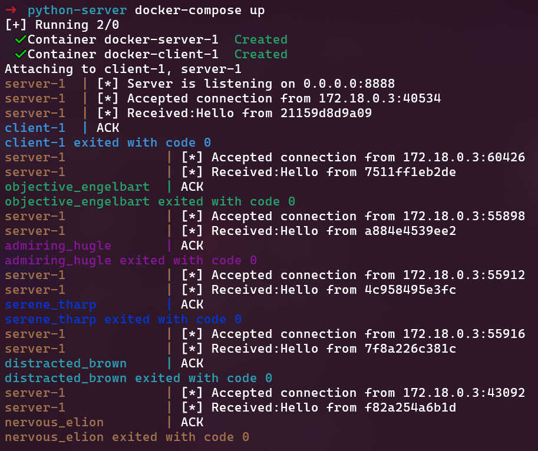
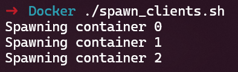

# Python-Client-Server-in-Docker
#### This application is a simple example of client/server communication written in Python and launched in Docker. How to use it?
* docker-compose up  
* ./spawn_clients.sh  
#### What happens?
1) Docker compose will create two containers. One is **server** and the other is **client**. The client container will exit immediately after sending information about its **hostname** to the server.
2) Besides that server container will return 'ACK' to the client.
3) The bash script is going to spawn other **client** containers, send information to the **server** and delete them until the loop ends.  
#### An example
  
  

This is a simple communication between containers inside the network created by docker compose.
